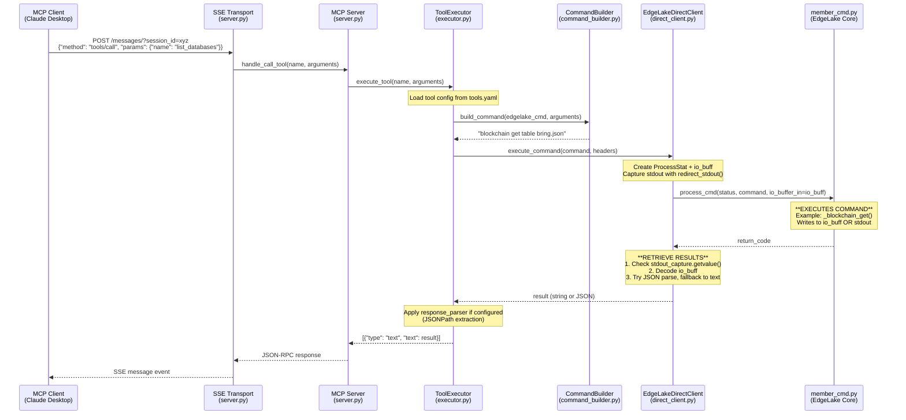
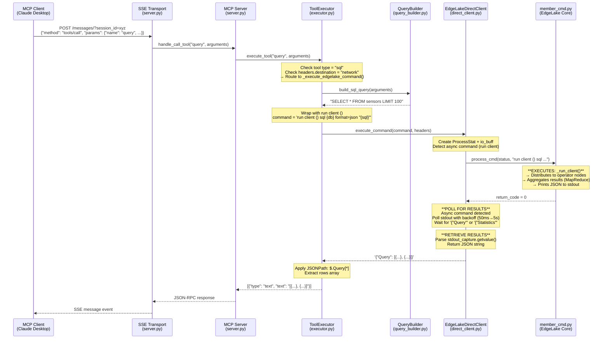

# MCP Tool Execution Flow - Sequence Diagrams

This document shows the execution flow for MCP tools from client to EdgeLake core.

## Path 1: Standard Tools (list_databases, list_tables, get_schema, node_status, server_info)



### Key Points - Standard Tools:

1. **Configuration-Driven**: Tool behavior defined in `tools.yaml`
2. **Generic Path**: All tools use `_execute_edgelake_command()`
3. **Command Building**: `CommandBuilder` fills template from `tools.yaml`
4. **Direct Integration**: `EdgeLakeDirectClient` calls `member_cmd.process_cmd()` directly
5. **Response Parsing**: JSONPath extraction applied per `tools.yaml` config

### Example Tool Configuration (list_databases):
```yaml
- name: list_databases
  description: "List all available databases"
  edgelake_command:
    type: "get"
    method: "blockchain_table"
    template: "blockchain get table bring.json"
    response_parser:
      type: "jsonpath"
      extract_path: "$[*].table.dbms"
      unique: true
      sort: true
```

---

## Path 2: Query Tool (Distributed SQL Queries)

### Path 2A: Network Query (Distributed - Most Common)



### Path 2B: Local Query - Batch Mode


### Path 2C: Local Query - Streaming Mode (Future)


### Key Points - Query Tool:

1. **Dual Path**:
   - **Network Queries**: `destination: network` → Standard command path with `run client ()`
   - **Local Queries**: No network destination → QueryExecutor for validation + streaming

2. **Network Query Flow** (Most Common):
   - Uses `run client ()` wrapper for distributed execution
   - No local database connectivity required
   - Results consolidated by EdgeLake's query node
   - Supports MapReduce-style aggregation

3. **Local Query Flow** (Rare):
   - Validates SQL via `select_parser()` first
   - Requires local database connection
   - Used for single-node queries only

4. **SQL Building**: `QueryBuilder` constructs SQL from:
   - `select`: Column list
   - `where`: Filter conditions
   - `group_by`: Grouping columns
   - `order_by`: Sorting
   - `limit`: Row limit

### Query Tool Configuration:
```yaml
- name: query
  description: "Execute distributed SQL query"
  edgelake_command:
    type: "sql"
    method: "query"
    build_sql: true
    headers:
      destination: "network"  # Routes to network
    response_parser:
      type: "jsonpath"
      extract_path: "$.Query[*]"
```

---

## Comparison: Standard Tools vs Query Tool

| Aspect | Standard Tools | Query Tool |
|--------|---------------|------------|
| **Execution Path** | Always `_execute_edgelake_command()` | Checks `destination: network` |
| **Command Building** | `CommandBuilder` (template fill) | `QueryBuilder` (SQL construction) |
| **EdgeLake Command** | Direct (e.g., `blockchain get table`) | Wrapped with `run client ()` for network |
| **Validation** | None (EdgeLake handles) | Optional via `select_parser()` (local only) |
| **Database Required** | No | No (for network), Yes (for local) |
| **Response Format** | Varies by command | Always `{"Query": [...]}` |
| **JSONPath Parsing** | Tool-specific paths | `$.Query[*]` extraction |

---

## First Level in Non-MCP Code: EdgeLake Core Functions

### member_cmd.py - Main Entry Point

All paths call this function:

```python
# edge_lake/cmd/member_cmd.py

def process_cmd(status: ProcessStat,
                command: str,
                print_cmd: bool = False,
                source_ip: str = None,
                source_port: int = None,
                io_buffer_in: bytearray = None) -> int:
    """
    Main command processor for EdgeLake.

    Args:
        status: ProcessStat object for state tracking
        command: EdgeLake command string to execute
        io_buffer_in: Output buffer (results written here)

    Returns:
        int: Status code (0 = success)

    Flow:
        1. Parse command string
        2. Look up command in commands dict
        3. Execute command function (e.g., _blockchain_get, _run_client)
        4. Populate io_buffer_in OR print to stdout
        5. Return status code
    """
```

**Result Retrieval** (in DirectClient):
```python
# After process_cmd() returns:

# 1. Check stdout (for print commands like blockchain get)
stdout_output = stdout_capture.getvalue()

# 2. Check io_buff (for commands that write to buffer)
io_buff_output = io_buff.decode('utf-8').rstrip('\x00')

# 3. Prefer stdout if both present
result = stdout_output if stdout_output.strip() else io_buff_output
```

### Commands Called by MCP Tools:

| MCP Tool | EdgeLake Command | Function Called in member_cmd.py | Output Method |
|----------|------------------|----------------------------------|---------------|
| `list_databases` | `blockchain get table bring.json` | `_blockchain_get()` | stdout |
| `list_tables` | `blockchain get table bring.json` | `_blockchain_get()` | stdout |
| `get_schema` | `get columns where ...` | `_get_columns()` | io_buff |
| `node_status` | `get status` | `_get_status()` | io_buff |
| `query` (network) | `run client () sql ...` | `_run_client()` | stdout (async) |
| `query` (local batch) | n/a - uses db_info directly | n/a | n/a |
| `query` (local stream) | n/a - uses db_info directly | n/a | n/a |

### db_info module - Query Execution (Local Queries Only)

For local batch/streaming queries, we bypass member_cmd and call db_info directly:

```python
# edge_lake/dbms/db_info.py

def select_parser(status: ProcessStat,
                  select_parsed: SelectParsed,
                  dbms_name: str,
                  sql_query: str,
                  is_subprocess: bool,
                  trace_level: int) -> Tuple[int, str, str]:
    """
    Validate and transform SQL query.

    Returns:
        (ret_val, table_name, validated_sql)

    Transformations:
        - View resolution
        - Permission checks
        - Distributed query transforms (e.g., AVG → SUM+COUNT)
    """

def set_cursor(status: ProcessStat,
               cursor: CursorInfo,
               dbms_name: str) -> int:
    """
    Open database cursor for query execution.

    Returns:
        0 on success
    """

def process_sql_stmt(status: ProcessStat,
                     cursor: CursorInfo,
                     sql_statement: str) -> int:
    """
    Execute SQL statement on open cursor.

    Returns:
        0 on success
    """

def process_fetch_rows(status: ProcessStat,
                       cursor: CursorInfo,
                       output_prefix: str,  # "Query"
                       fetch_size: int,     # Rows per batch
                       title_list: List[str],  # Column names
                       data_types_list: List[str]) -> Tuple[bool, str]:
    """
    Fetch next batch of rows from cursor.

    Returns:
        (get_next: bool, rows_data: str)

        get_next: True if more rows available
        rows_data: JSON string like '{"Query": [...]}'
    """

def close_cursor(status: ProcessStat,
                 cursor: CursorInfo) -> int:
    """
    Close database cursor and free resources.

    Returns:
        0 on success
    """
```

### Key Difference: Batch vs Streaming

**Batch Mode (Current):**
```python
# Collect ALL rows before returning
all_rows = []
while True:
    get_next, rows_data = db_info.process_fetch_rows(...)
    rows = json.loads(rows_data)["Query"]
    all_rows.extend(rows)
    if not get_next:
        break

# Return everything at once
return {"rows": all_rows, "total_rows": len(all_rows)}
```

**Streaming Mode (Future):**
```python
# Yield each batch as received
while True:
    get_next, rows_data = db_info.process_fetch_rows(...)
    rows = json.loads(rows_data)["Query"]

    # YIELD immediately - don't wait for all rows
    yield {"type": "data", "rows": rows, "row_count": len(rows)}

    if not get_next:
        break

# Final message
yield {"type": "complete", "total_rows": total_count}
```

**Benefits of Streaming:**
- Memory efficient for large result sets
- Client gets data faster (first batch arrives immediately)
- Better for real-time dashboards
- Can display progress to user

---

## Architecture Principles Enforced:

✅ **All tool behavior in tools.yaml** - No hardcoded tool logic
✅ **Generic handlers only** - Executor has NO tool-specific methods
✅ **Direct integration** - No HTTP overhead in embedded mode
✅ **Configuration-driven parsing** - JSONPath defined in tools.yaml
✅ **Single source of truth** - EdgeLake's member_cmd.py

---

## Reference Files:

- **Tool Definitions**: `edge_lake/mcp_server/config/tools.yaml`
- **Executor**: `edge_lake/mcp_server/tools/executor.py`
- **Command Builder**: `edge_lake/mcp_server/core/command_builder.py`
- **Query Builder**: `edge_lake/mcp_server/core/query_builder.py`
- **Query Executor**: `edge_lake/mcp_server/core/query_executor.py`
- **Direct Client**: `edge_lake/mcp_server/core/direct_client.py`
- **EdgeLake Core**: `edge_lake/cmd/member_cmd.py`
