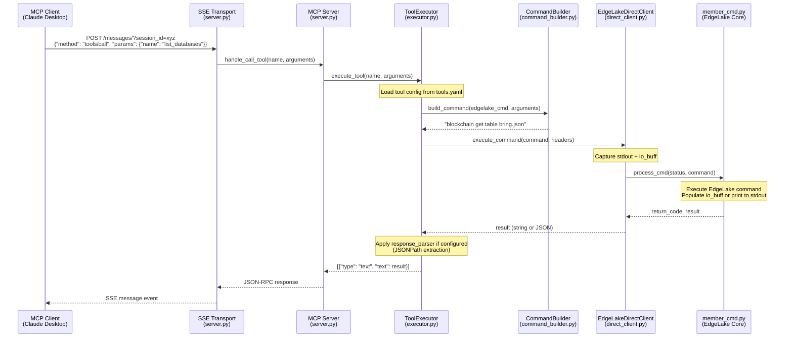
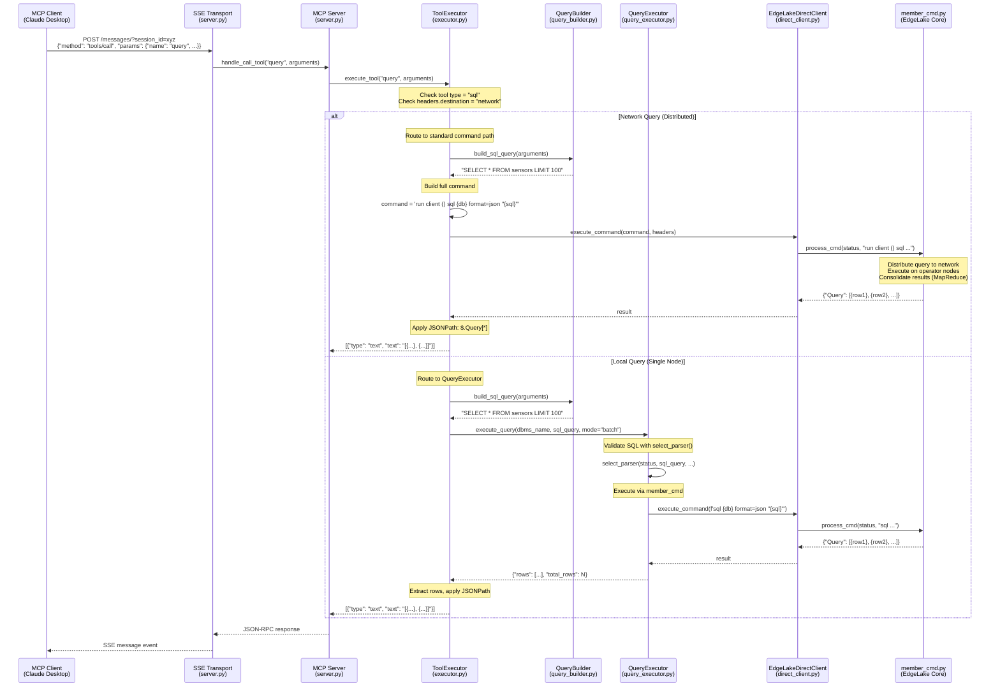

# MCP Tool Execution Flow - Sequence Diagrams

This document shows the execution flow for MCP tools from client to EdgeLake core.

## Path 1: Standard Tools (list_databases, list_tables, get_schema, node_status, server_info)



### Key Points - Standard Tools:

1. **Configuration-Driven**: Tool behavior defined in `tools.yaml`
2. **Generic Path**: All tools use `_execute_edgelake_command()`
3. **Command Building**: `CommandBuilder` fills template from `tools.yaml`
4. **Direct Integration**: `EdgeLakeDirectClient` calls `member_cmd.process_cmd()` directly
5. **Response Parsing**: JSONPath extraction applied per `tools.yaml` config

### Example Tool Configuration (list_databases):
```yaml
- name: list_databases
  description: "List all available databases"
  edgelake_command:
    type: "get"
    method: "blockchain_table"
    template: "blockchain get table bring.json"
    response_parser:
      type: "jsonpath"
      extract_path: "$[*].table.dbms"
      unique: true
      sort: true
```

---

## Path 2: Query Tool (Distributed SQL Queries)



### Key Points - Query Tool:

1. **Dual Path**:
   - **Network Queries**: `destination: network` → Standard command path with `run client ()`
   - **Local Queries**: No network destination → QueryExecutor for validation + streaming

2. **Network Query Flow** (Most Common):
   - Uses `run client ()` wrapper for distributed execution
   - No local database connectivity required
   - Results consolidated by EdgeLake's query node
   - Supports MapReduce-style aggregation

3. **Local Query Flow** (Rare):
   - Validates SQL via `select_parser()` first
   - Requires local database connection
   - Used for single-node queries only

4. **SQL Building**: `QueryBuilder` constructs SQL from:
   - `select`: Column list
   - `where`: Filter conditions
   - `group_by`: Grouping columns
   - `order_by`: Sorting
   - `limit`: Row limit

### Query Tool Configuration:
```yaml
- name: query
  description: "Execute distributed SQL query"
  edgelake_command:
    type: "sql"
    method: "query"
    build_sql: true
    headers:
      destination: "network"  # Routes to network
    response_parser:
      type: "jsonpath"
      extract_path: "$.Query[*]"
```

---

## Comparison: Standard Tools vs Query Tool

| Aspect | Standard Tools | Query Tool |
|--------|---------------|------------|
| **Execution Path** | Always `_execute_edgelake_command()` | Checks `destination: network` |
| **Command Building** | `CommandBuilder` (template fill) | `QueryBuilder` (SQL construction) |
| **EdgeLake Command** | Direct (e.g., `blockchain get table`) | Wrapped with `run client ()` for network |
| **Validation** | None (EdgeLake handles) | Optional via `select_parser()` (local only) |
| **Database Required** | No | No (for network), Yes (for local) |
| **Response Format** | Varies by command | Always `{"Query": [...]}` |
| **JSONPath Parsing** | Tool-specific paths | `$.Query[*]` extraction |

---

## First Level in Non-MCP Code: member_cmd.py

Both paths converge at `edge_lake/cmd/member_cmd.py`:

```python
def process_cmd(status: ProcessStat, command: str, ...) -> int:
    """
    Main command processor for EdgeLake.

    This is the entry point from MCP server's EdgeLakeDirectClient.

    Flow:
    1. Parse command string
    2. Look up command in commands dict
    3. Execute command function
    4. Populate io_buff or print to stdout
    5. Return status code
    """
```

### Commands Called by MCP Tools:

| MCP Tool | EdgeLake Command | Command Function |
|----------|------------------|------------------|
| `list_databases` | `blockchain get table` | `_blockchain_get()` |
| `list_tables` | `blockchain get table` | `_blockchain_get()` |
| `get_schema` | `get columns where ...` | `_get_columns()` |
| `node_status` | `get status` | `_get_status()` |
| `query` (network) | `run client () sql ...` | `_run_client()` → `_sql_parse()` |
| `query` (local) | `sql {db} format=json "..."` | `_sql_parse()` |

---

## Architecture Principles Enforced:

✅ **All tool behavior in tools.yaml** - No hardcoded tool logic
✅ **Generic handlers only** - Executor has NO tool-specific methods
✅ **Direct integration** - No HTTP overhead in embedded mode
✅ **Configuration-driven parsing** - JSONPath defined in tools.yaml
✅ **Single source of truth** - EdgeLake's member_cmd.py

---

## Reference Files:

- **Tool Definitions**: `edge_lake/mcp_server/config/tools.yaml`
- **Executor**: `edge_lake/mcp_server/tools/executor.py`
- **Command Builder**: `edge_lake/mcp_server/core/command_builder.py`
- **Query Builder**: `edge_lake/mcp_server/core/query_builder.py`
- **Query Executor**: `edge_lake/mcp_server/core/query_executor.py`
- **Direct Client**: `edge_lake/mcp_server/core/direct_client.py`
- **EdgeLake Core**: `edge_lake/cmd/member_cmd.py`
