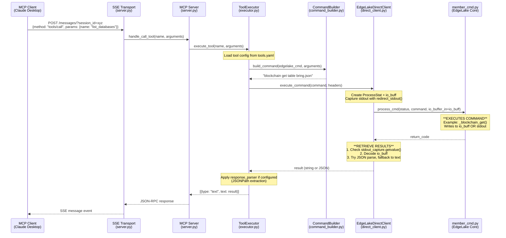
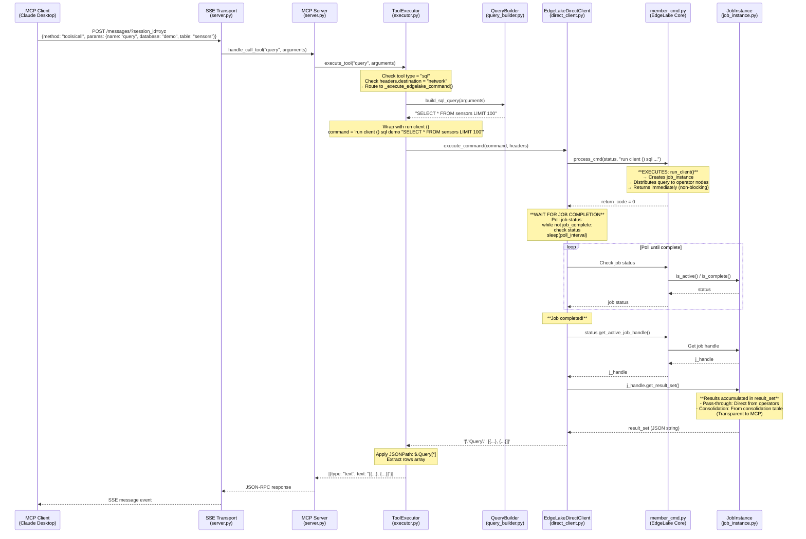
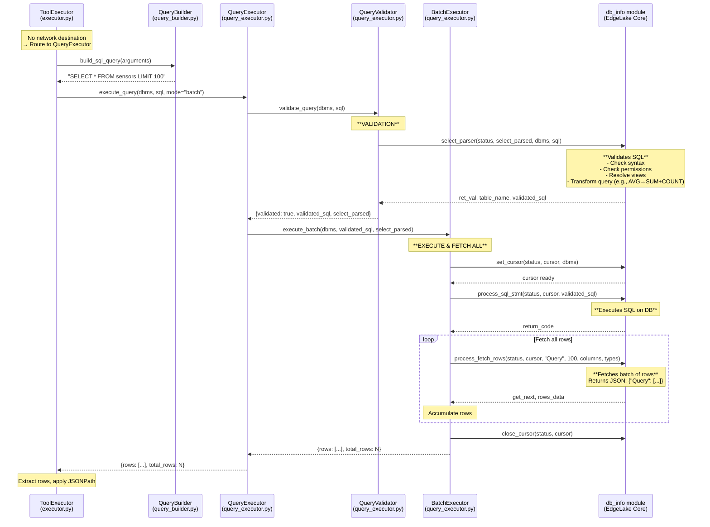
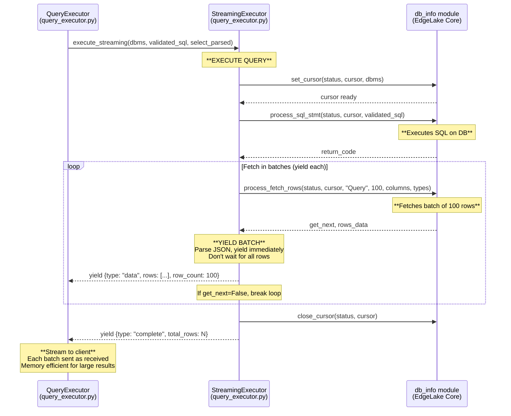

# MCP Tool Execution Flow - Sequence Diagrams

This document shows the execution flow for MCP tools from client to EdgeLake core.

## Architecture Overview

The MCP server implements **three distinct execution paths**:

1. **Standard Tools** (list_databases, list_tables, get_schema, node_status, server_info)
2. **Network SQL Queries** (distributed queries via `run client ()`)
3. **Local SQL Queries** (direct database queries with validation + streaming)

---

## Path 1: Standard Tools

Standard tools use command templates from `tools.yaml` and execute directly via `member_cmd.process_cmd()`.



### Key Points - Standard Tools:

1. **Configuration-Driven**: Tool behavior defined in `tools.yaml`
2. **Generic Path**: All tools use `_execute_edgelake_command()`
3. **Command Building**: `CommandBuilder` fills template from `tools.yaml`
4. **Direct Integration**: `EdgeLakeDirectClient` calls `member_cmd.process_cmd()` directly
5. **Response Parsing**: JSONPath extraction applied per `tools.yaml` config

### Example Tool Configuration (list_databases):
```yaml
- name: list_databases
  description: "List all available databases"
  edgelake_command:
    type: "get"
    method: "blockchain_table"
    template: "blockchain get table bring.json"
    response_parser:
      type: "jsonpath"
      extract_path: "$[*].table.dbms"
      unique: true
      sort: true
```

---

## Path 2: Network SQL Queries (Distributed Queries)

Network queries are distributed across operator nodes using `run client ()`. This path handles both pass-through and consolidation queries transparently.



### Key Points - Network Queries:

1. **Distributed Execution**: Uses `run client ()` wrapper
   - Query distributed to multiple operator nodes
   - Results consolidated on query node
   - MapReduce-style parallel execution

2. **Asynchronous Pattern**:
   - `process_cmd()` returns immediately
   - Creates `job_instance` to manage query
   - MCP polls for completion
   - Retrieves results from `j_handle.get_result_set()`

3. **Pass-Through vs Consolidation** (Internal EdgeLake Optimization):
   - **Pass-Through** (`is_pass_through() = True`):
     - Simple queries (SELECT with WHERE, no aggregates)
     - Results stream directly from operators → `result_set`
     - No consolidation table created

   - **Consolidation** (`is_pass_through() = False`):
     - Aggregate queries (AVG, SUM, COUNT, GROUP BY, ORDER BY)
     - Results → consolidation table (`query_N`) → `result_set`
     - Query node performs final aggregation

   - **Note**: Both use same MCP code path! The difference is handled internally by EdgeLake.

4. **Result Retrieval**:
   - NOT via stdout (doesn't work for distributed queries)
   - NOT via `query_local_dbms()` call from MCP
   - Via `j_handle.get_result_set()` after job completion

5. **No Local Database Required**: Query node doesn't need database connection (operators have the data)

### Network Query Tool Configuration:
```yaml
- name: query
  description: "Execute distributed SQL query"
  edgelake_command:
    type: "sql"
    method: "query"
    build_sql: true
    headers:
      destination: "network"  # Routes to network path
    response_parser:
      type: "jsonpath"
      extract_path: "$.Query[*]"
```

---

## Path 3: Local SQL Queries (Direct Database Access)

Local queries execute directly on the query node's database using low-level streaming APIs.



### Streaming Mode (Future Enhancement)



### Key Points - Local Queries:

1. **Direct Database Access**:
   - Queries execute on query node's local database
   - Requires local database connection
   - Uses low-level `db_info` APIs for streaming

2. **Validation First**:
   - Always validates via `select_parser()`
   - Ensures SQL correctness before execution
   - Applies necessary transformations

3. **Two Execution Modes**:
   - **Batch Mode** (current): Accumulates all rows before returning
   - **Streaming Mode** (future): Yields rows as fetched (memory efficient)

4. **When Used**:
   - Queries on local databases only
   - Not distributed across network
   - Direct database access required

---

## Comparison: Three Execution Paths

| Aspect | Standard Tools | Network SQL Queries | Local SQL Queries |
|--------|---------------|---------------------|-------------------|
| **Execution Path** | `_execute_edgelake_command()` | `_execute_edgelake_command()` | `_execute_sql_query()` |
| **Command Building** | `CommandBuilder` (template) | `QueryBuilder` (SQL) | `QueryBuilder` (SQL) |
| **EdgeLake Command** | Direct (e.g., `blockchain get`) | Wrapped: `run client () sql ...` | N/A (direct db_info calls) |
| **Validation** | None (EdgeLake handles) | None (EdgeLake handles) | Via `select_parser()` |
| **Database Required** | No | No (operators have data) | Yes (local database) |
| **Execution Model** | Synchronous | Asynchronous (job_instance) | Synchronous |
| **Result Retrieval** | io_buff OR stdout | `j_handle.get_result_set()` | `process_fetch_rows()` |
| **Response Format** | Varies by command | `{"Query": [...]}` | `{"Query": [...]}` |
| **JSONPath Parsing** | Tool-specific paths | `$.Query[*]` | `$.Query[*]` |
| **Distributed** | N/A | Yes (multi-node) | No (single node) |

---

## First Level in Non-MCP Code: EdgeLake Core Functions

### member_cmd.py - Main Entry Point

Standard tools and network queries call this function:

```python
# edge_lake/cmd/member_cmd.py

def process_cmd(status: ProcessStat,
                command: str,
                print_cmd: bool = False,
                source_ip: str = None,
                source_port: int = None,
                io_buffer_in: bytearray = None) -> int:
    """
    Main command processor for EdgeLake.

    Args:
        status: ProcessStat object for state tracking
        command: EdgeLake command string to execute
        io_buffer_in: Output buffer (results written here)

    Returns:
        int: Status code (0 = success)

    Flow:
        1. Parse command string
        2. Look up command in commands dict
        3. Execute command function (e.g., _blockchain_get, run_client)
        4. Populate io_buffer_in OR print to stdout
        5. Return status code
    """
```

**Result Retrieval** (in DirectClient):
```python
# After process_cmd() returns:

# For standard tools (synchronous):
# 1. Check stdout (for print commands like blockchain get)
stdout_output = stdout_capture.getvalue()

# 2. Check io_buff (for commands that write to buffer)
io_buff_output = io_buff.decode('utf-8').rstrip('\x00')

# 3. Prefer stdout if both present
result = stdout_output if stdout_output.strip() else io_buff_output
```

```python
# For network queries (asynchronous):
# 1. Wait for job completion
while not job_complete:
    # Poll job status
    time.sleep(poll_interval)

# 2. Get job handle
j_handle = status.get_active_job_handle()

# 3. Get accumulated results
result_set = j_handle.get_result_set()  # JSON string
```

### Commands Called by MCP Tools:

| MCP Tool | EdgeLake Command | Function Called in member_cmd.py | Output Method |
|----------|------------------|----------------------------------|---------------|
| `list_databases` | `blockchain get table bring.json` | `_blockchain_get()` | stdout |
| `list_tables` | `blockchain get table bring.json` | `_blockchain_get()` | stdout |
| `get_schema` | `get columns where ...` | `_get_columns()` | io_buff |
| `node_status` | `get status` | `_get_status()` | io_buff |
| `query` (network) | `run client () sql ...` | `run_client()` | `j_handle.get_result_set()` |
| `query` (local) | n/a - uses db_info directly | n/a | `process_fetch_rows()` |

### db_info module - Query Execution (Local Queries Only)

For local batch/streaming queries, we bypass member_cmd and call db_info directly:

```python
# edge_lake/dbms/db_info.py

def select_parser(status: ProcessStat,
                  select_parsed: SelectParsed,
                  dbms_name: str,
                  sql_query: str,
                  is_subprocess: bool,
                  trace_level: int) -> Tuple[int, str, str]:
    """
    Validate and transform SQL query.

    Returns:
        (ret_val, table_name, validated_sql)

    Transformations:
        - View resolution
        - Permission checks
        - Distributed query transforms (e.g., AVG → SUM+COUNT)
    """

def set_cursor(status: ProcessStat,
               cursor: CursorInfo,
               dbms_name: str) -> int:
    """
    Open database cursor for query execution.

    Returns:
        0 on success
    """

def process_sql_stmt(status: ProcessStat,
                     cursor: CursorInfo,
                     sql_statement: str) -> int:
    """
    Execute SQL statement on open cursor.

    Returns:
        0 on success
    """

def process_fetch_rows(status: ProcessStat,
                       cursor: CursorInfo,
                       output_prefix: str,  # "Query"
                       fetch_size: int,     # Rows per batch
                       title_list: List[str],  # Column names
                       data_types_list: List[str]) -> Tuple[bool, str]:
    """
    Fetch next batch of rows from cursor.

    Returns:
        (get_next: bool, rows_data: str)

        get_next: True if more rows available
        rows_data: JSON string like '{"Query": [...]}'
    """

def close_cursor(status: ProcessStat,
                 cursor: CursorInfo) -> int:
    """
    Close database cursor and free resources.

    Returns:
        0 on success
    """
```

### job_instance.py - Distributed Query Management (Network Queries Only)

For network queries, `run_client()` creates a job_instance:

```python
# edge_lake/job/job_instance.py

class JobInstance:
    """
    Manages distributed query execution.

    Key responsibilities:
    - Track query state across operator nodes
    - Accumulate results from multiple operators
    - Handle pass-through vs consolidation internally
    """

    def is_active(self) -> bool:
        """Check if job is still running."""

    def is_complete(self) -> bool:
        """Check if job has completed."""

    def is_pass_through(self) -> bool:
        """
        Determine if query uses pass-through optimization.

        Pass-through = True:
          - Simple SELECT queries
          - No aggregates, GROUP BY, ORDER BY
          - Results stream directly from operators

        Pass-through = False:
          - Aggregate functions (AVG, SUM, COUNT)
          - GROUP BY, ORDER BY clauses
          - Results go to consolidation table first
        """
```

```python
# edge_lake/job/job_handle.py

class JobHandle:
    """
    Handle for accessing job results.
    """

    def get_result_set(self) -> str:
        """
        Get accumulated query results.

        Returns:
            JSON string with results

        Note:
            This method works for both pass-through and
            consolidation queries. The difference is handled
            internally by EdgeLake.
        """
        return self.result_set
```

### Key Difference: Batch vs Streaming (Local Queries)

**Batch Mode (Current):**
```python
# Collect ALL rows before returning
all_rows = []
while True:
    get_next, rows_data = db_info.process_fetch_rows(...)
    rows = json.loads(rows_data)["Query"]
    all_rows.extend(rows)
    if not get_next:
        break

# Return everything at once
return {"rows": all_rows, "total_rows": len(all_rows)}
```

**Streaming Mode (Future):**
```python
# Yield each batch as received
while True:
    get_next, rows_data = db_info.process_fetch_rows(...)
    rows = json.loads(rows_data)["Query"]

    # YIELD immediately - don't wait for all rows
    yield {"type": "data", "rows": rows, "row_count": len(rows)}

    if not get_next:
        break

# Final message
yield {"type": "complete", "total_rows": total_count}
```

**Benefits of Streaming:**
- Memory efficient for large result sets
- Client gets data faster (first batch arrives immediately)
- Better for real-time dashboards
- Can display progress to user

---

## Architecture Principles Enforced:

✅ **All tool behavior in tools.yaml** - No hardcoded tool logic
✅ **Generic handlers only** - Executor has NO tool-specific methods
✅ **Direct integration** - No HTTP overhead in embedded mode
✅ **Configuration-driven parsing** - JSONPath defined in tools.yaml
✅ **Single source of truth** - EdgeLake's member_cmd.py
✅ **Two query paths** - Network (distributed) vs Local (direct)

---

## Reference Files:

- **Tool Definitions**: `edge_lake/mcp_server/config/tools.yaml`
- **Executor**: `edge_lake/mcp_server/tools/executor.py`
- **Command Builder**: `edge_lake/mcp_server/core/command_builder.py`
- **Query Builder**: `edge_lake/mcp_server/core/query_builder.py`
- **Query Executor**: `edge_lake/mcp_server/core/query_executor.py`
- **Direct Client**: `edge_lake/mcp_server/core/direct_client.py`
- **EdgeLake Core**: `edge_lake/cmd/member_cmd.py`
- **Job Management**: `edge_lake/job/job_instance.py`, `edge_lake/job/job_handle.py`
- **Database API**: `edge_lake/dbms/db_info.py`
